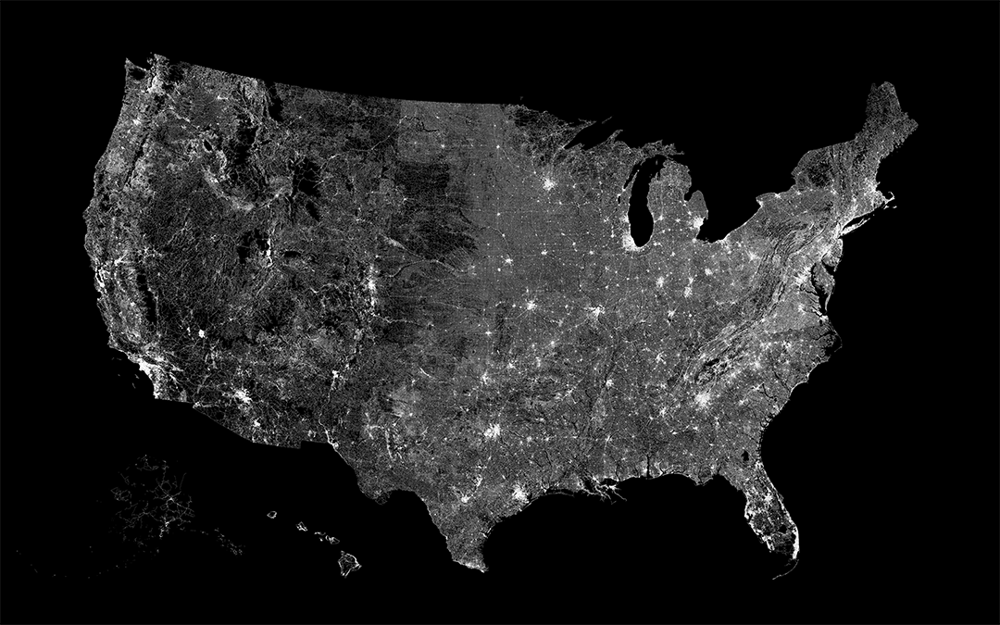

# All the streets of a America

Generate your own map of every street in America, inspired by Fathom's [All streets](http://3rdfloor.fathom.info/products/all-streets) poster.

First run:

    npm install

You might have to install cairo, if you haven't already. See the instructions on [node-canvas](https://github.com/Automattic/node-canvas) project page.

You might also need to install the `ogr2gr2` and `topojson` command line utilities. (ogr2ogr is included in the gdal package.) Checkout Mike Bostock's [Let's make a map](http://bost.ocks.org/mike/map/) for more details.

    brew install gdal

    npm install -g topojson

Next, run

    node download.js

To download the data for the [US Census](http://www2.census.gov/geo/tiger/TIGER2014/ROADS/) website and run ogr2gr as well as convert the geojson files to topojson. Grab coffee. It's going to take a while (1-2 hours on my macbook air).

Now you can run

    node draw.js

Which will generate the image and save it to `out/out.png`. Feel free to modify the `draw.js` script to your liking. This should take about 10-20 minutes at the default resolution.
